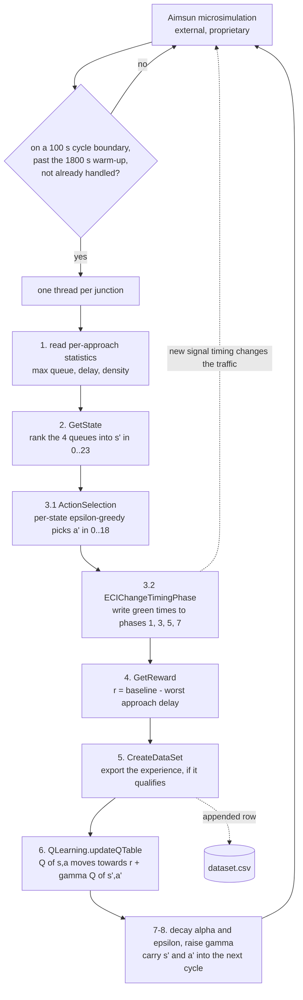

# Reinforcement Learning for Traffic Signal Control

**Research artifact (2018). Not maintained.** Precursor code for a paper published in
*The Journal of Supercomputing* — see [Relationship to the paper](#relationship-to-the-paper)
for exactly which part it covers, and which it does not.

[](LICENSE)
[](#running-it)
[](https://doi.org/10.1007/s11227-020-03287-x)

One tabular reinforcement-learning agent per junction, embedded in the
[Aimsun](https://www.aimsun.com/) microscopic traffic simulator. Each agent watches the queues
on its four approaches, redistributes green time between them, and learns from the resulting
change in delay — then exports its settled decisions as a labelled dataset.

---

## Why it exists

Traffic signal timings are normally fixed plans, computed off-line from historical counts. They
are wrong the moment traffic differs from the average. Letting an agent retime a junction on-line
is straightforward to state and awkward to do:

- **The state space explodes.** Encoding actual queue lengths per approach gives an
  effectively continuous space that tabular methods cannot cover.
- **Nothing transfers.** An agent that learns "when queue A is 40 vehicles, do X" has learned
  something true only of one junction at one demand level. Every other junction starts from zero.
- **Experience is expensive.** Each decision costs a control cycle of simulated time, and a
  junction has to be watched for hours of it before its Q-values mean anything.

The approach taken here attacks the first two together: **the state is the *ranking* of the four
approach queues, not their sizes.** There are exactly 4! = 24 orderings, so the Q-table is 24 x 19
and small enough to fill. And because a ranking says which approach is under most pressure
without saying how much, two junctions of quite different size can be in the same state — which is
the precondition for one agent's experience being worth anything to another.

The third problem is the one the published work went after, and this repository is where the
experience it needs gets collected — see [Relationship to the paper](#relationship-to-the-paper).

## How it works

Aimsun loads `Main.py` as an AAPI extension and calls its hooks as the simulation runs.
`AAPIInit` walks the network once, resolves each junction's incoming approaches from its signal
groups, and creates one agent per junction. `AAPIPostManage` then fires a control decision every
100 simulated seconds, after a 1800 s warm-up, with each junction handled on its own thread.



Note the one-cycle offset in steps 4-6: the reward and the Q-update are attributed to the
state/action pair chosen on the **previous** cycle, because only now has that action had time to
show up in the delay figures.

### State — 24 orderings

`GetState.getState` takes the four approach queue lengths and returns which of the 24 orderings
they are in. State 0 is `q0 >= q1 >= q2 >= q3`, state 23 is the exact reverse, and the other 22
cover everything between. Comparisons are `>=`, so ties fall through to the first branch that
accepts them.

### Actions — 19 splits of a fixed cycle

`ActionSelection.getPhaseDuration` maps an action index to four green durations. **All 19 total
92 seconds**, which is the design constraint that makes the action space safe: the agent can only
move green time between approaches, never lengthen or shorten the cycle. The controller writes to
phases 1, 3, 5 and 7 only; the other 8 s of the 100 s cycle belong to the phases in between, which
it never touches.

| actions | green times | effect |
| --- | --- | --- |
| 0-5 | rearrangements of `{33, 33, 13, 13}` | favour two approaches strongly |
| 6-17 | rearrangements of `{33, 23, 23, 13}` | favour one, starve one |
| 18 | `{23, 23, 23, 23}` | uniform; also the fallback branch |

### Exploration — per state, not global

`probabilityOfRandomAction` is a **vector indexed by state**, all entries starting at 1.0. It is
decayed by 0.02, until it falls below 0.01, only for the state just observed and only when the
action taken there was exploratory. Rare traffic patterns therefore keep exploring long after
common ones have settled, instead of being frozen out by a single global epsilon that decayed
while they were not being seen.

### Reward — beat your own recent best

`GetReward.getReward` scores the junction by its **worst** approach, `max(delayTime)`, so an
action that clears three approaches by starving the fourth earns nothing. That is compared
against the harmonic mean of the last five scores, held in a five-slot sliding window on the
agent. Reward is positive when the current worst delay comes in under that baseline. The
harmonic mean is pulled towards the smallest recent delays, which makes it a harder target than
an arithmetic mean would be.

### Update rule

`QLearning.updateQTable` applies

```
Q(s,a) <- Q(s,a) + alpha * [ r + gamma * Q(s',a') - Q(s,a) ]
```

This is the **on-policy (SARSA) form** — the bootstrap term is the Q-value of the action actually
selected for the next state, not the maximum over that state's actions, so exploratory moves are
folded into the estimate rather than discarded. The module name says Q-learning; the code says
SARSA. Read the update rule, not the filename.

The learning rate starts at 0.5 and decays by 0.005 per decision until it drops below 0.01, while
the discount factor starts at 0.5 and **rises** by 0.005 per decision until it passes 0.9 — the
agent is deliberately myopic while its estimates are noisy and grows more far-sighted as they
settle.

## Relationship to the paper

> Norouzi, M., Abdoos, M., Bazzan, A.L.C. **Experience classification for transfer learning in
> traffic signal control.** *The Journal of Supercomputing* **77**, 780–795 (2021).
> Published online 27 April 2020. <https://doi.org/10.1007/s11227-020-03287-x>

This repository is by that paper's first author (see `git log`) and predates the publication by
two years. It is the **source-task stage**, not a reproduction package. Being precise about the
boundary, because it is checkable:

**What is here.** The learner that generates the experience: one tabular agent per junction,
learning signal-timing plans on-line in Aimsun. And `ReinforcementLearningPack/CreateDataSet.py`,
which writes that experience out as one CSV row per decision — raw traffic measurements (delay,
density and queue length per approach) as features, the action index as the label. Rows are only
written for decisions that pass three gates: the action was greedy rather than exploratory, it
earned a positive reward, and its state had been visited more than 30 times. That is a filter for
*settled* experience — the agent's learned answer for a traffic situation, rather than a guess it
has not yet revised. Feature-and-label rows of settled experience are what a classifier over
experience consumes.

**What is not here.** No classifier, no transfer step, no target task, no evaluation, no metrics.
Outside the vendored `AAPI.py`, the only imports anywhere in this repository are `random`, `csv`
and `threading` — there is no machine-learning library to be found. This code stops at producing
`dataset.csv`.

So: read it as the reinforcement-learning side of the work, and as the code that produces the
experience data. Do not read it as an implementation of the paper's transfer-learning
contribution.

### Companion repository

[`Holonic-Multi-Agent-System-TSC`](https://github.com/mojtabanorouzie/Holonic-Multi-Agent-System-TSC)
was started six days later, in June 2018, and reuses `ReinforcementLearningPack` from here almost
verbatim — four of its five modules are byte-identical to the ones here, and its agent class
differs only by two extra fields. On top of that it adds a `SecondLevelRL` package
(`CreateHolon.py`, `SecondLevelAgent.py`, `ActionSelectionFirstLevel.py`,
`ActionSelectionSecondLevel.py`) putting a second, supervising level of agents above the
per-junction ones. This repository is the flat version: one agent per junction, no coordination
between them.

## Running it

**It cannot be run from this repository alone, and there is no way around that.** `Main.py` is not
a program — it has no `__main__`, and its first statement is `from AAPI import *`. It runs only
inside Aimsun's embedded Python interpreter.

To run it you would need all of:

1. **A licensed Aimsun installation** with a loaded network. Aimsun is commercial software; it is
   not obtainable through this repository.
2. **The compiled `_AAPI` extension module**, which ships with Aimsun. The `AAPI.py` in this
   repository is only the SWIG-generated Python stub — every function in it forwards to `_AAPI`,
   which is not here. See [`THIRD_PARTY_NOTICES.md`](THIRD_PARTY_NOTICES.md).
3. **Python 2.7** — the interpreter Aimsun embedded at the time. `Main.py` calls `xrange`, and
   `AAPI.py` uses `import new` and Python 2 `raise` syntax. Neither runs on Python 3.
4. **A network of four-approach signalised junctions**, with a signal plan whose green phases are
   1, 3, 5 and 7. `mainProcess` reads statistics from exactly four approaches per junction and
   writes green times to exactly those four phases.

Given all four, `Main.py` is attached to the scenario as an AAPI extension and the simulation is
started; Aimsun does the rest.

*Unverified: no Aimsun licence was available to re-run any of this. The steps above are read off
the code, not off a working run.*

### What you can run

The two modules with no Aimsun dependency happen to be syntax-compatible with Python 3, so their
structure can be checked on any machine:

```bash
git clone https://github.com/mojtabanorouzie/Reinforcement-Learning-TSC.git
cd Reinforcement-Learning-TSC
python -m unittest discover -s tests -v
```

Seven tests, no dependencies beyond the standard library. They assert the design invariants named
above — that the 24 orderings map one-to-one onto the 24 states, and that every one of the 19
actions totals 92 s of green. `.github/workflows/tests.yml` runs the same command on every push.

## What it produces

- **`dataset.csv`**, appended to by `CreateDataSet.create_dataset`. One row per qualifying
  decision, 14 columns, **no header**: `[state, delay x4, density x4, max_queue x4, action]`.
  Written to `../dataset.csv` — relative to Aimsun's working directory, not this package's.
- **Aimsun log lines** for one junction only. `Main.py` traces state transitions, action, reward
  and action type via `AKIPrintString`, gated on `debugJunctionId = 549` so the log is not
  flooded. That id is specific to the network this was run against; change it to trace a
  different junction.
- **Nothing persistent otherwise.** Q-tables live in memory and are gone when the simulation ends.

No trained model, no results and no network file are committed here.

## Project layout

```
Main.py                              Aimsun AAPI entry point: hooks, hyperparameters,
                                     agent construction, the per-cycle control loop
ReinforcementLearningPack/
    QLearning.py                     the agent class and the TD update
    GetState.py                      4 queue lengths -> state index 0..23
    ActionSelection.py               per-state epsilon-greedy + the 19 green-time splits
    GetReward.py                     delay vs. a 5-slot harmonic-mean baseline
    CreateDataSet.py                 export settled experience to dataset.csv
tests/                               structural tests for the state and action tables
.github/workflows/tests.yml          runs those tests on push
AAPI.py                              vendored Aimsun binding - NOT this project's code
```

## Limitations and known gaps

Stated plainly, because this is 2018 research code and reads better as what it is:

- **Four approaches assumed.** `mainProcess` indexes `idSectionIn[0..3]` unconditionally. A
  junction with a different number of approaches raises `IndexError`.
- **The dataset write is not thread-safe.** Each junction runs on its own thread and each thread
  reads and writes only its own agent, so agents do not race. But `create_dataset` opens and
  appends to one shared file from all of them with no lock. Rows can interleave.
- **Each exported row straddles two control cycles.** `Main.py` passes the *previous* cycle's
  state and action as columns 0 and 13, but the measurements read on the *current* cycle as
  columns 1-12. Column 0 is therefore not the discretisation of columns 1-12 sitting beside it,
  and the greedy gate applies to the current cycle's action rather than the one being labelled.
  This may be deliberate — the features then describe the situation the action produced rather
  than the one that prompted it — but the code says nothing either way, so it is left untouched
  and flagged here. Anyone reusing `dataset.csv` should decide which alignment they want.
- **The reward baseline is inflated during warm-up.** `harmonicMean` always divides by the window
  length while skipping zero entries, so until the five-slot window fills, the baseline sits above
  the true harmonic mean of the values present and is easier to beat.
- **Hyperparameters are module-level globals** in `Main.py` with no way to override them per run —
  changing an experiment means editing the file.
- **No experiment harness.** No seeding, no run configuration, no metric logging, no plots. The
  only observability is `AKIPrintString` on a single hardcoded junction id.
- **`updateQTable` takes four parameters it never uses**, kept as-is rather than changed, since
  this is the code the 2018 work ran on.
- **Python 2.7 only**, and dependent on a proprietary simulator. Neither is fixable without a
  rewrite.
- **One bug was fixed long after the research, not during it.** The branch for state 16 compared
  the wrong pair of queues, which made that state unreachable and silently aliased the ordering it
  should have matched onto state 0. The typo was present from the initial commit, so the original
  runs had a dead Q-table row and one state conflating two opposite traffic situations. See commit
  `fix: make state 16 reachable in the queue-ordering encoder`; `tests/` now locks it down.

## Licence and third-party code

The [MIT licence](LICENSE) covers `Main.py`, `ReinforcementLearningPack/`, `tests/` and the
documentation.

It does **not** cover `AAPI.py`. That file is a SWIG-generated binding onto the Aimsun simulator's
proprietary API, published by Aimsun S.L., and is not this project's work. It is present so the
controller can be read as an ordinary Python module. Details in
[`THIRD_PARTY_NOTICES.md`](THIRD_PARTY_NOTICES.md).

## Citation

If you refer to the research this code belongs to, cite the paper rather than the repository:

```bibtex
@article{norouzi2021experience,
  title   = {Experience classification for transfer learning in traffic signal control},
  author  = {Norouzi, Mojtaba and Abdoos, Monireh and Bazzan, Ana L. C.},
  journal = {The Journal of Supercomputing},
  volume  = {77},
  number  = {1},
  pages   = {780--795},
  year    = {2021},
  doi     = {10.1007/s11227-020-03287-x},
  url     = {https://doi.org/10.1007/s11227-020-03287-x}
}
```
